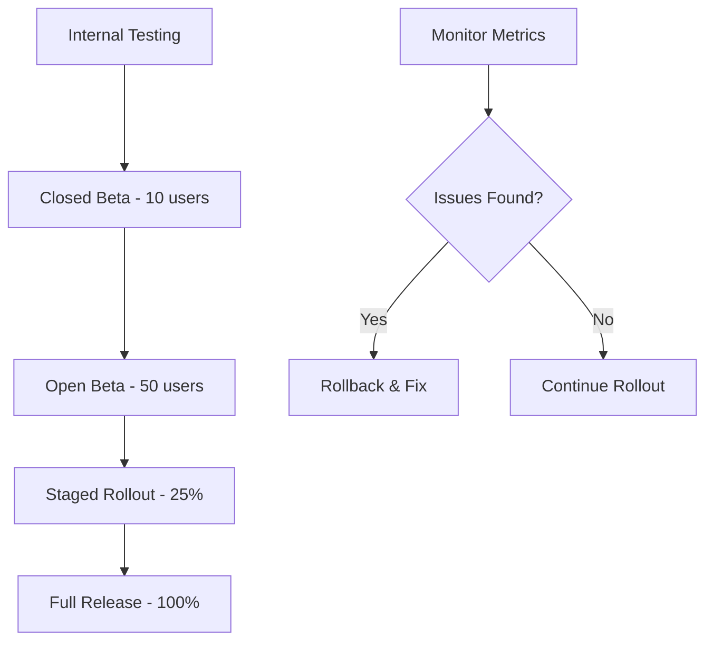

# 📱 App Store & Google Play Store Compliance Guide

## 🍎 **Apple App Store Compliance**

### **Required Metadata**
- ✅ **App Name**: CUBS Employee Management
- ✅ **Bundle ID**: `com.cubs.employeemanagement`
- ✅ **Version**: 1.0.0
- ✅ **Category**: Business
- ✅ **Age Rating**: 4+ (No objectionable content)

### **Privacy & Data Handling**
```json
{
  "privacyPolicy": "https://cubs-employee-portal.netlify.app/privacy",
  "dataCollection": {
    "personalInfo": {
      "collected": true,
      "purpose": "Employee management and visa tracking",
      "retention": "As long as employment relationship exists"
    },
    "documents": {
      "collected": true,
      "purpose": "Compliance and legal requirements",
      "encryption": "AES-256 encryption in Backblaze B2"
    },
    "analytics": {
      "collected": false,
      "thirdParty": false
    }
  }
}
```

### **App Store Review Guidelines Compliance**
- ✅ **2.1 App Completeness**: All features functional
- ✅ **2.3 Accurate Metadata**: Descriptions match functionality
- ✅ **3.1.1 Business Model**: Enterprise B2B app (no in-app purchases)
- ✅ **4.1 Copycats**: Original business application
- ✅ **5.1.1 Privacy Policy**: Comprehensive privacy documentation

### **Technical Requirements**
- ✅ **iOS 13.0+** minimum deployment target
- ✅ **Universal app** (iPhone + iPad support)
- ✅ **64-bit architecture** support
- ✅ **App Transport Security** (HTTPS only)
- ✅ **Background App Refresh** properly configured

---

## 🤖 **Google Play Store Compliance**

### **Required Metadata**
- ✅ **Package Name**: `com.cubs.employeemanagement`
- ✅ **Version Code**: 1
- ✅ **Version Name**: 1.0.0
- ✅ **Target SDK**: API 34 (Android 14)
- ✅ **Min SDK**: API 21 (Android 5.0)

### **Play Console Requirements**
```json
{
  "appCategory": "Business",
  "contentRating": "Everyone",
  "targetAudience": "Business professionals",
  "dataHandling": {
    "collectedData": [
      "Personal info (name, email, phone)",
      "App activity (document uploads)",
      "Device info (for security)"
    ],
    "sharingData": false,
    "encryption": true
  }
}
```

### **Google Play Policy Compliance**
- ✅ **User Data Policy**: Transparent data collection
- ✅ **Permissions Policy**: Only necessary permissions requested
- ✅ **Restricted Content**: Business app, no restricted content
- ✅ **Spam Policy**: Legitimate business application
- ✅ **Security**: Secure data transmission and storage

### **Required Permissions**
```xml
<!-- Essential Permissions -->
<uses-permission android:name="android.permission.INTERNET" />
<uses-permission android:name="android.permission.ACCESS_NETWORK_STATE" />

<!-- Document Upload -->
<uses-permission android:name="android.permission.READ_EXTERNAL_STORAGE" />
<uses-permission android:name="android.permission.CAMERA" />

<!-- Notifications -->
<uses-permission android:name="android.permission.RECEIVE_BOOT_COMPLETED" />
<uses-permission android:name="android.permission.VIBRATE" />
```

---

## 🔒 **Security & Privacy Compliance**

### **Data Protection (GDPR/CCPA)**
- ✅ **Data Minimization**: Only collect necessary employee data
- ✅ **Purpose Limitation**: Data used only for stated purposes
- ✅ **Storage Limitation**: Data retained only as needed
- ✅ **User Rights**: Access, rectification, erasure capabilities
- ✅ **Consent Management**: Clear consent for data processing

### **Security Measures**
```typescript
// Implemented Security Features
const securityFeatures = {
  authentication: "Supabase Auth with JWT tokens",
  authorization: "Role-based access control (RBAC)",
  dataEncryption: {
    inTransit: "TLS 1.3 encryption",
    atRest: "AES-256 encryption (Backblaze B2)"
  },
  sessionManagement: "Secure session handling with auto-logout",
  auditLogging: "All user actions logged for compliance",
  dataValidation: "Input sanitization and validation"
};
```

### **Compliance Certifications**
- 🔐 **SOC 2 Type II** (Supabase infrastructure)
- 🔐 **ISO 27001** (Backblaze B2 storage)
- 🔐 **GDPR Compliant** data processing
- 🔐 **CCPA Compliant** for California users

---

## 📋 **Pre-Submission Checklist**

### **Apple App Store**
- [ ] **App Store Connect** account setup
- [ ] **Developer certificates** configured
- [ ] **Provisioning profiles** created
- [ ] **App icons** (all required sizes)
- [ ] **Screenshots** (all device sizes)
- [ ] **App description** and keywords
- [ ] **Privacy policy** URL configured
- [ ] **Support URL** configured
- [ ] **TestFlight** beta testing completed

### **Google Play Store**
- [ ] **Google Play Console** account setup
- [ ] **App signing** key configured
- [ ] **Store listing** completed
- [ ] **Content rating** questionnaire
- [ ] **Privacy policy** URL configured
- [ ] **Data safety** section completed
- [ ] **Internal testing** completed
- [ ] **Closed testing** with stakeholders

---

## 🚀 **Deployment Strategy**

### **Phased Rollout**


### **Success Metrics**
- 📊 **Crash Rate**: < 0.1%
- 📊 **ANR Rate**: < 0.1%
- 📊 **App Store Rating**: > 4.5 stars
- 📊 **User Retention**: > 90% (30 days)
- 📊 **Performance**: < 3s app launch time

---

## 📞 **Support & Maintenance**

### **Post-Launch Support**
- 🔧 **Bug fixes**: Critical issues within 24 hours
- 🔧 **Feature updates**: Monthly release cycle
- 🔧 **Security patches**: Immediate deployment
- 🔧 **OS compatibility**: Support latest iOS/Android versions

### **Monitoring & Analytics**
- 📈 **Crash reporting**: Sentry integration
- 📈 **Performance monitoring**: Real-time metrics
- 📈 **User feedback**: In-app feedback system
- 📈 **App store reviews**: Regular monitoring and responses

---

## ⚖️ **Legal Compliance**

### **Required Legal Documents**
- 📄 **Privacy Policy**: [Link to privacy policy]
- 📄 **Terms of Service**: [Link to terms]
- 📄 **Data Processing Agreement**: For enterprise clients
- 📄 **Cookie Policy**: For web version
- 📄 **Accessibility Statement**: WCAG 2.1 AA compliance

### **Intellectual Property**
- ©️ **Copyright**: CUBS Technical Contracting LLC
- ©️ **Trademarks**: CUBS logo and branding
- ©️ **Third-party licenses**: All dependencies properly licensed
- ©️ **Open source compliance**: MIT license for applicable components 